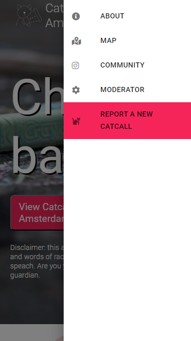

# Catcalls of Amsterdam

A full-stack application to visualize, report and manage data on catcalling. Made for @CatcallsofAms, a local Instagram-based initiative part of a global 'chalk back' movement. In over a 150 cities wordwide, young girls are fighting street harassment by literally chalking catcalls on the sidewalk and raise awareness. For more information check out https://www.instagram.com/catcallsofams/ and https://www.chalkback.org/.

Launch test version: January 2021 - (work continued on main repo)
The server Repo is located [Here](https://github.com/lisannekraal/catcall-server)

  </img>
  </img>

# Main features

### Data visualization on a map

Using Mapbox' open source API, an interactive map displays the catcalls from a MongoDB database and allows users to zoom, pan and interact with the catcalls layer on the map. They can find information for their own neighborhood or favorite parts of the city, read the catcalls and the stories from the victims, and find the related images on Instagram. A newly added feature allows visitors to 'react' to the catcalls by clicking a bullhorn ticker that keeps track of the number of times clicked.

  </img>
  </img>

### Easy report of new catcalls

Users can report a catcall anonymously, without signing up. They can provide context information, date of happening and the specific location location. When reported, the catcall will not be shown on the map untill a moderator has validated the report. This is because some reports might contain unwanted details such as personal characteristics of the perpetrator, might be too long or done with the wrong intentions.

### Managing incoming catcalls by moderators

Moderators are assigned by each verified local 'Catcalls of...' organisor, such as CatcallsofAms. They have admin rights to moderate incoming catcalls and the existing database. Through a moderator dashboard moderators can:
- verify, edit and delete incoming catcalls
- search through and manage the entire database of catcalls
- see a list of catcalls that are staged to be chalked by the organisation
- update catcalls with the chalked image of Instagram
- delete the trashbin (only for mods with full authority)
- add extra moderators (only for mods with full authority)

  </img>
  </img>

# How to

### ..run locally for development purposes

- clone the repo
- `yarn install` from main repo, client folder and server folder
- create a .env through `touch .env` in server folder
- save local MongoDB url as `DB_URL={your url}` or MongoDB Atlas url as `DB_ATLAS_URL={your url}`
- add your own secret key for jsonwebtoken as `JWT_SECRET_KEY={your key}`
- create a .env through `touch .env` in client folder
- define localhost url as `REACT_APP_APOLLO_SERVER={your localhost}`
- add Mapbox access token as `REACT_APP_MAPBOX_ACCESS_TOKEN={your token}`
- add personal recaptcha key as `REACT_APP_RECAPTCHA_KEY={your key}`
- add instagram API key as `REACT_APP_INSTAGRAM_KEY={your key}`
- add `SKIP_PREFLIGHT_CHECK=true`
- `yarn start` in server to start server listening
- `yarn start` in client folder to start React app

### ...create catcalls and user

Use `yarn populate` to automatically populate the database with mockcatcalls from `mockCatcallsSeed.js` and a moderator with full authority defined in `createTestAdmin.js`.

Or solely run `createTestAdmin.js` to create a moderator and log in using the provided credentials. To add catcall data you can also use the app's submit functionality. Do not forget to log in and verify those incoming catcalls first, because they won't be displayed on the map without verification.

### ..run tests

While developing client, run `yarn test` to test correct routing, incurrent url and redirects. While developing server, run `yarn test` to test server resolvers.

# About

### Team

This app has been developed by [Lisanne Kraal](https://github.com/lisannekraal) as a personal project. She is a new full-stack developer with a love for anything geospatial.

[Alejandro Rene Valdivia](https://github.com/serendatapy) joined the team and contributed greatly in performance improvement, debugging, enhancements and deployment of the pilot version.

Inspired by Ambrien Moeniralam of [CatcallsofAms](https://www.instagram.com/catcallsofams/), the team believes local initiatives like these should be supported with technological solutions. This is a start in the process of supporting management and visualization of spatial data for 'catcalls of...' initiatives worldwide.

### A special thanks to

- Ambrien Moeniralam by being patient in the process of creation and a perfect end-user
- [Nikos Cocci](https://github.com/Nik439) for reviewing and improving the code at an early stage together with Alejandro Rene Valdivia
- [Camille Desoubrie](https://github.com/Kmyll) for help with the logo
- Aafke Smal and Jochem Gugelot for advice
- Sophie Sandberg ([CatcallsofNYC](https://www.instagram.com/catcallsofnyc/)) for consulting on this topic and support of 'CatcallsOf...' wordwide

# Contribute

Please reach out if you have any advice or would like to contribute to this project. We especially are in need of experienced developers to evaluate our Amsterdam pilot and branch out to other parts of the world.
